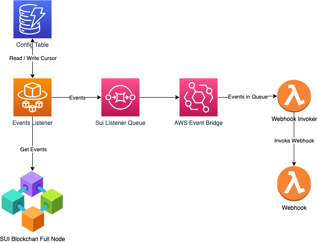
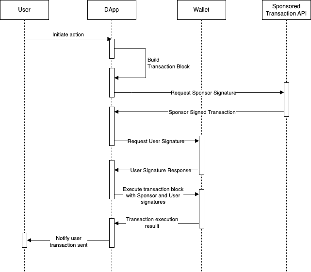

# SUI Integration Examples

This repository provides examples of various integrations with the SUI blockchain.

There are two types of integrations currently:

1. Event listeners and webhooks.
2. Sponsored transactions.

The code is implemented in TypeScript and runs within the AWS Cloud environment using serverless technologies. [Serverless](https://www.serverless.com/) is used for deployments. [Serverless Offline](https://www.serverless.com/plugins/serverless-offline) is used to run the code locally.

## Event Listeners and Webhooks

The diagram below depicts the architecture of system components used for events and webhooks.



### **Components:**
- The **Events Listener** is an ECS Fargate task that runs continuously and polls new events from the SUI full node.
- The **Sui Listener Queue** is a FIFO SQS queue where the listener adds events for further processing.
- The **Webhook Invoker** is a Lambda function responsible for invoking webhooks.
- The **Event Bridge** invokes the **Webhook Invoker** Lambda whenever new items are added to the **Sui Listener Queue**.
- The **Webhook** is an AWS Lambda function responsible for processing a single event from the SUI blockchain.

### **Workflow:**
1. The **Events Listener** runs in a continuous loop, making RPC calls to `suix_queryEvents` to retrieve new events for a configured package ID. Each time it starts reading from a cursor value stored in DynamoDB. The cursor value is updated after reading events.

2. Whenever the **Events Listener** identifies new events, it adds them to the **Sui Listener Queue**.

3. The **AWS Event Bridge** triggers the **Webhook Invoker** Lambda as soon as new items are added to the **Sui Listener Queue**.

4. The **Webhook Invoker** invokes the **Webhook** for each event it reads from the queue.

### Running locally

- Serverless offline plugin is used to run the solution locally. Listener runs in ECS task in the cloud. ECS is not available for serverless offline. For that reason, uncomment `sui-events-listener` lambda function in serverless.yml. This function will read new events from the blockchain once per minute.

- Install dependencies:
```
npm install
```

- Install DynamoDb 
```
sls dynamodb install
```

If you are getting an error `Error getting DynamoDb local latest tar.gz location undefined: 403` on this step then it means that there is still a known issue in `serverless-dynamodb-local` plugin.
It is discussed [here](https://github.com/99x/serverless-dynamodb-local/issues/294).
  - In `node_modules/dynamodb-localhost/dynamodb/config.json`change URL to `https://s3.us-west-2.amazonaws.com/dynamodb-local/dynamodb_local_latest.tar.gz` (add s to http)
  - In `node_modules/dynamodb-localhost/dynamodb/installer.j` change `http` to `https`

- To start services run
```
npm run dev
```

### Deploy to AWS

1. Install AWS CLI

1. Configure AWS CLI
```
aws configure
```

1. Modify values in `stages\test.yml` and `stages\prod.yml`

1. Start deployment
```
npm run deploy:test
```
or
```
npm run deploy:prod
```


## Sponsored Transactions

Sui Move includes functionality that enables builders to cover the gas fees for some or all of their app transactions. This functionality eliminates one of the most significant challenges users encounter when transitioning to Web3. Normally, on Web3 networks, users are required to pay a gas fee to use an app. However, Sui's sponsored transaction feature removes this obstacle for builders who are willing to adopt it.

The diagram below illustrates the sequence of steps for executing a sponsored transaction:



The Lambda function `sui-sign-sponsored-transaction` is responsible for signing the sponsored transaction. Sponsor signer private key is stored in AWS Secrets Manager.

Here's an example of client code:


```typescript
// Call sponsored transaction API for sponsor signature. 
// Note that package Id is configured in the API.
const response = await fetch('http://localhost:5000/blockchain/sui-sign-sponsored-transaction', {
    method: 'POST',
    headers: {
      Accept: 'application/json',
      'Content-Type': 'application/json',
    },
    body: JSON.stringify({
      sender: wallet.address,
      module: libName,
      action,
      arguments: data,
    }),
  });

const sponsorSignedTransaction = await response.json();
const transactionBlock = TransactionBlock.from(sponsorSignedTransaction?.transactionBlockBytes);

const senderSignedTransaction = await wallet.signTransactionBlock({
    transactionBlock,
  });

const executeResponse = await provider.executeTransactionBlock({
    transactionBlock: sponsorSignedTransaction?.transactionBlockBytes,
    signature: [sponsorSignedTransaction?.signatureBytes, senderSignedTransaction.signature],
    options: { showEffects: true },
    requestType: 'WaitForLocalExecution',
  });
```