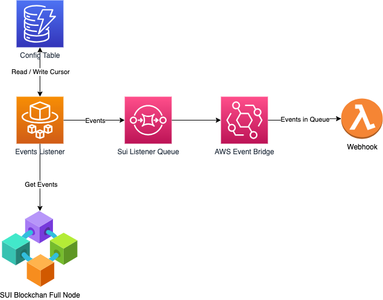

# SUI Integrations Examples

This repository provides examples of various integrations with SUI blockchain.

There are 2 types of integrations currently:

1. Events listener and webhooks;
1. Sponsored transactions.

The code is implemented in TypeScript and runs in AWS Cloud environment using serverless technologies. [Serverless](https://www.serverless.com/) is used for deployments. [Serverless Offline](https://www.serverless.com/plugins/serverless-offline) is used to run code locally. 

## Events listener and webhooks

The diagram below describes the architecture of system components used for events and webhooks.



Components:
- **Events Listener** is ECS Fargate task that is constantly running and polling new events from SUI full node.
- **Sui Listener Queue** is FIFO SQS queue where listener adds pushes events for further processing.
- **Webhook Invoker** is lambda that is responsible for invoking Webhook.
- **Event Bridge** invokes **Webhook Invoker** lambda whenever new items are added to **Sui Listener Queue**.
- **Webhook** is AWS lambda that is reposnsible for processing of a single event from SUI blockchain.

Workflow:
1. **Events Listener** in a constant loop calls RPC `suix_queryEvents` to get new events for a configured package id. Everytime it begins to read from a cursor value saved in DynamoDb. New cursor vallue is updated after reading events.

1. Whenever **Events Listener** finds new events it adds them to **Sui Listener Queue**.

1. **AWS Event Bridge** invokes **Webhook Invoker** lambda as soon as new items are added to **Sui Listener Queue**.

1. **Webhook Invoker** invokes **Webhook** for each event that it reads from the queue.

## Sponsored Transactions

Sui Move includes functionality that lets builders pay the gas fees for some or all of their app transactions, eliminating one of the biggest hurdles users face in moving to Web3. Typically on Web3 networks, users pay what's called a gas fee to use an app. Sui's sponsored transaction functionality eliminates this friction for builders willing to adopt it.

The diagram below demonstrates the sequence of steps to execute sponsored transaction:


Lambda function `sui-sign-sponsored-transaction` is responsible for signing the sponsored transaction.

Client code example is below:

```typescript
// Call sponsored transaction API for sponsor signature. 
// Note that package Id is configured in the API.
const response = await fetch('http://localhost:5000/blockchain/sui-sign-sponsored-transaction', {
    method: 'POST',
    headers: {
      Accept: 'application/json',
      'Content-Type': 'application/json',
    },
    body: JSON.stringify({
      sender: wallet.address,
      module: libName,
      action,
      arguments: data,
    }),
  });

const sponsorSignedTransaction = await response.json();
const transactionBlock = TransactionBlock.from(sponsorSignedTransaction?.transactionBlockBytes);

const senderSignedTransaction = await wallet.signTransactionBlock({
    transactionBlock,
  });

const executeResponse = await provider.executeTransactionBlock({
    transactionBlock: sponsorSignedTransaction?.transactionBlockBytes,
    signature: [sponsorSignedTransaction?.signatureBytes, senderSignedTransaction.signature],
    options: { showEffects: true },
    requestType: 'WaitForLocalExecution',
  });
```